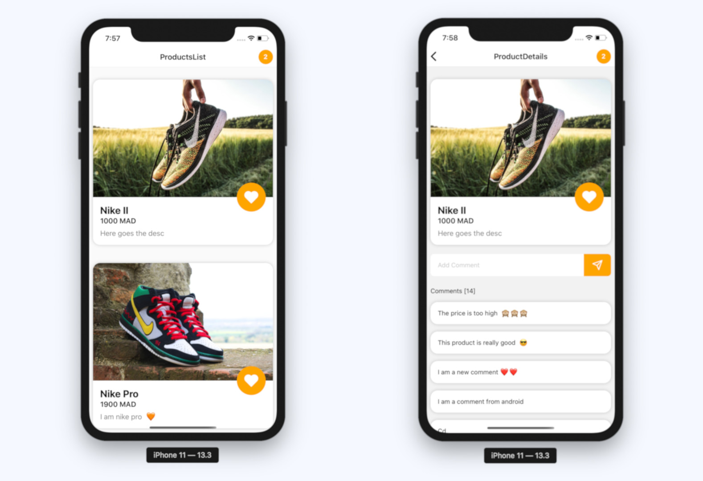

# ReactNativeApolloOnlineStore



This repo is the source code for a youtube series about how to create a react native online shop using apollo 3.

This is a ready to go production app, but a lab to show different ways of using the library.

For the backend, the app is using strapi headless CMS.

## How to run the project:

# Backend:

Go inside the server folder and run:

```
yarn develop
```

Then create an account and add some products and comments.

# Mobile:

Start the metro bundler:

```
yarn start
```

For android:

```
yarn android
```

For iOS:
```
yarn iOS
```

PS: make sure that you have installed all the required dependencies.

#Videos

I will add the videos as soon as I start publishing them.
